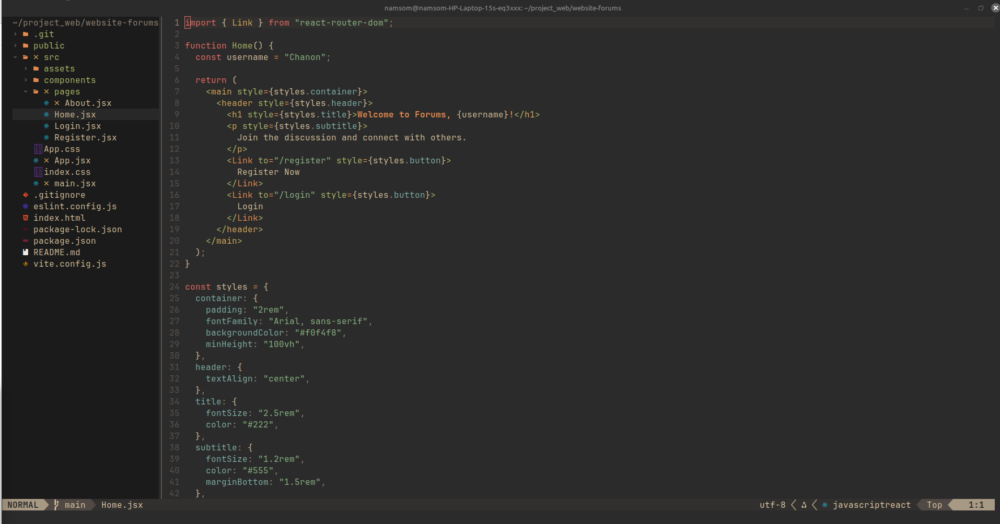

# Neovim Configuration

My personal Neovim setup with **lazy.nvim** plugin manager for Web Development.

---

## Features / Plugins

Here are the main plugins included in this config:

| Plugin | Description |
|--------|-------------|
| `nvim-tree/nvim-tree.lua` | File explorer |
| `nvim-telescope/telescope.nvim` | Fuzzy finder |
| `hrsh7th/nvim-cmp` | Autocompletion |
| `neovim/nvim-lspconfig` | LSP configurations |
| `akinsho/toggleterm.nvim` | Integrated terminal |
| `nvim-treesitter/nvim-treesitter` | Syntax highlighting & parsing |
| `gruvbox-community/gruvbox` | Color scheme |
| … | … add others as needed |

---

## Screenshots




---

## Installation

1. Clone the repo:

```bash
git clone git@github.com:deaww77/neovim.git ~/.config/nvim

